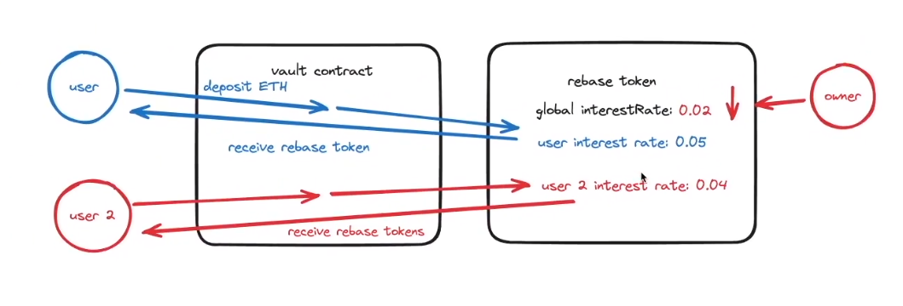

# Cross-chain Rebase Token

1. CCIP Rebase Token: A protocol that allow users to deposit into a vault and in return, receive rebase tokens that represents their underlying balance.

2. Rebase token -> dynamic balanceOf() to show changing balance with time.
   - Balance increases linearly with time
   - Mint token to users everytime an action is perform (minting, burning, transferring, bridging)

3. Interest rate: Rate at which the balance is increasing linearly with time
   - Individualy set an interest rate on each user based on some global interest rate of the protocol at the time the user desposits into the vault
   - This global interest rate can only decrease to incentivise/reward early adopters.
   - Increases token adoption
   - 

## Known Issues
- Owners can set themselves the role of "MINT_AND_BURN_ROLE"

## Design Flaws
- A user can initally deposit into to get a more preferred higher interest rate, then some time later, in order not to get a new lower interest rate when depositing more (interest rate will be reduced over time), the user would be able to use a second wallet to send over the deposit, thereby, retaining the higher interest rate 